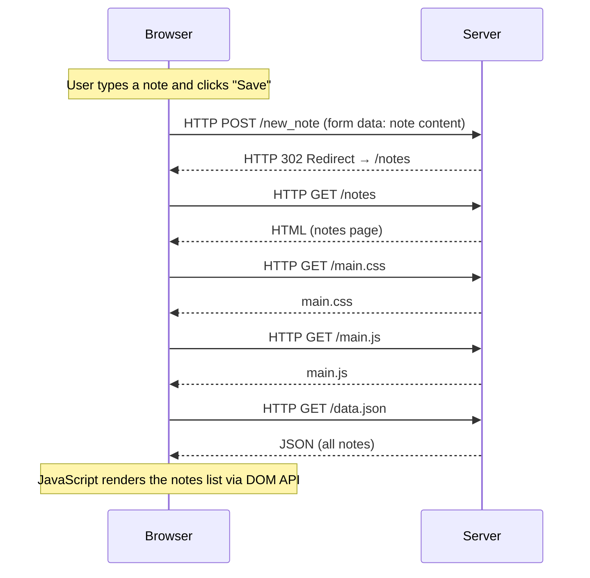

# Task 0.4 – New Note (Traditional Web App)

When the user submits the note form on the traditional Notes page, the browser sends a POST request. The server responds with a redirect, causing the browser to reload the entire page.

