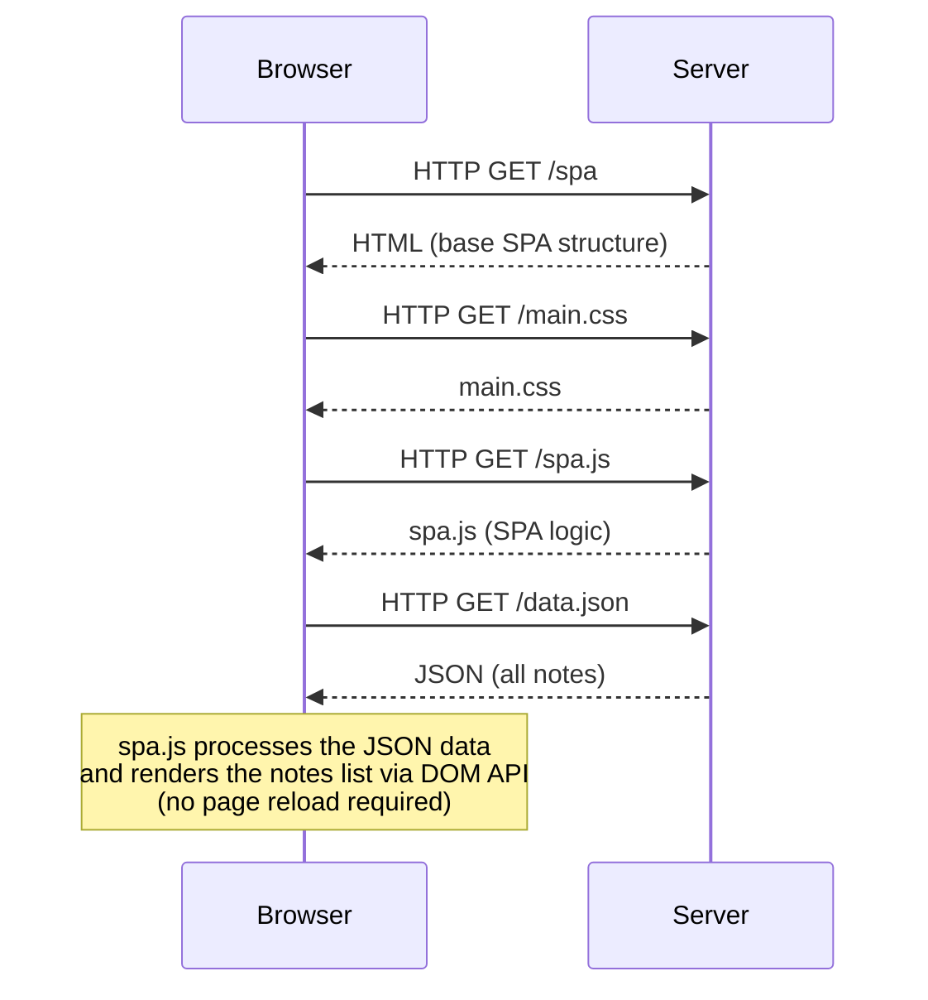

# Task 0.5 – Loading the SPA Notes Page

When the user navigates to the Single Page App version of the notes page, the browser fetches the base HTML, a stylesheet, the SPA JavaScript file, and the note data — then renders everything client-side without any further reloads.

