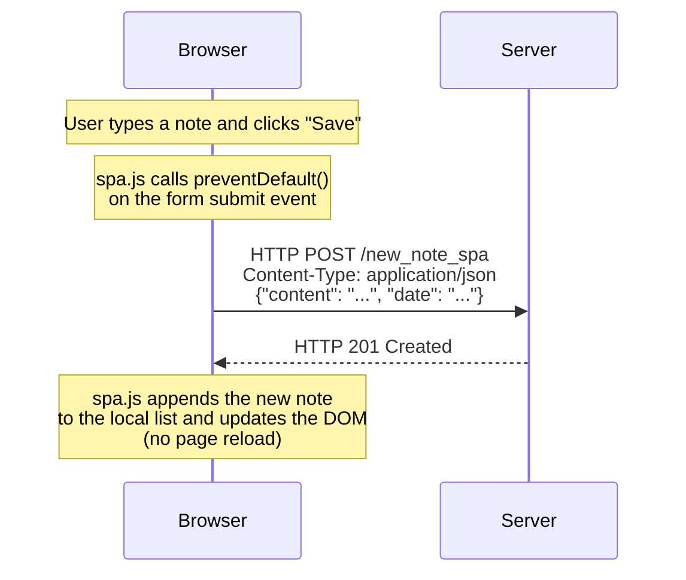

# Task 0.6 – New Note (SPA Version)

In the SPA, submitting a new note does not trigger a traditional form submission. Instead, `spa.js` intercepts the event, sends the data as JSON via POST, and updates the DOM directly — no redirect, no page reload.

